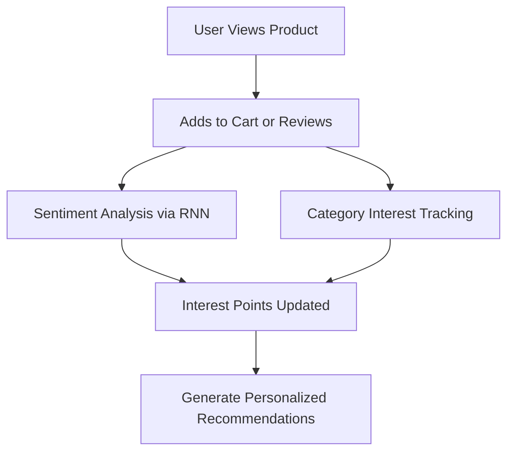

# 🛍️ Smart E-Commerce Platform with AI-Powered Recommendations

This is an intelligent E-Commerce web application that enhances the user shopping experience using Artificial Intelligence. It integrates **Computer Vision**, **Natural Language Processing (NLP)**, and **User Behavior Analysis** to deliver personalized product recommendations.

---

## 🚀 Features

### 🧠 AI-Powered Recommendation System
- **NLP-Based Similar Product Recommender**
  - Uses product descriptions and metadata to find semantically similar items.
  
- **Computer Vision-Based Similarity**
  - Uses CNN-based image feature extraction to recommend visually similar products.

- **Sentiment Analysis on Product Reviews**
  - Automatically analyzes user reviews (positive/negative) using an RNN-based model trained on Amazon review data.
  - Sentiment scores contribute to personalized recommendation logic.

- **User Interest Algorithm**
  - Tracks user behavior like:
    - Adding products to cart
    - Searching for specific items
    - Reviewing products
  - Assigns **Interest Points** to product categories based on actions and sentiment.
  - Dynamically recommends products from the most relevant categories.

### 🛒 E-Commerce Platform Essentials
- User registration & login with JWT Authentication
- Product browsing, search, and filtering
- Secure cart and checkout flow
- Product reviews and rating system

---

## 🛠️ Tech Stack

| Layer | Technology |
|-------|------------|
| **Frontend** | React.js, Tailwind CSS |
| **Backend** | Django, Django REST Framework |
| **Authentication** | JSON Web Tokens (JWT) |
| **ML/NLP** | Python, Scikit-learn, NLTK, RNN (for sentiment analysis), TF-IDF |
| **Computer Vision** | CNN (Convolutional Neural Networks), OpenCV |
| **Database** | PostgreSQL / SQLite |

---

## 🧠 Recommendation Workflow

---

## ⚠️ Note About Repository Size & Missing Files

> Due to GitHub's storage limitations, some **large files including trained ML models** (`.h5`, `.pkl`, etc.) have **not been pushed to the repository**.  
> The entire project exceeded GitHub's file size limits, so you may also notice **some major components (e.g., datasets, pre-trained models, or media folders) are missing**.

If you’re interested in running or testing the full application, feel free to contact me for access to the full project files and models.

---

## 💡 Future Enhancements

- Collaborative filtering with hybrid recommendation
- Recurrent user profiling with long-term interest tracking
- Deployment using Docker + CI/CD
- Admin dashboard with AI insights (product trends, user interest heatmaps)

---

## 📬 Contact

Created with ❤️ by **Tejas Narayan Jadhav**  
📧 Email: [tejasjadhav130704@example.com]  
🔗 LinkedIn: [https://www.linkedin.com/in/tejas-jadhav-385613256/](https://linkedin.com)

---

